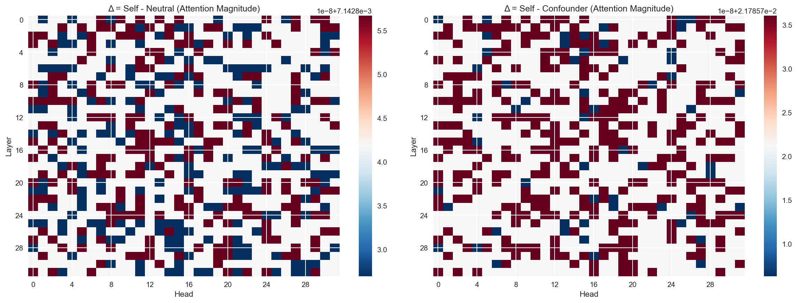
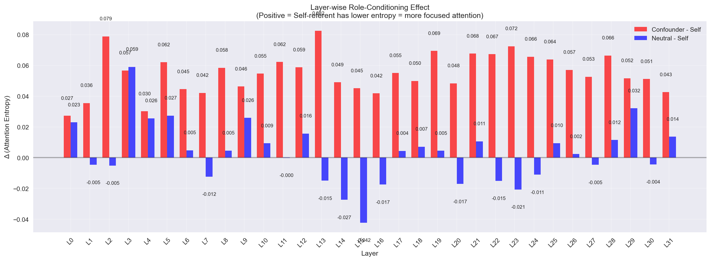
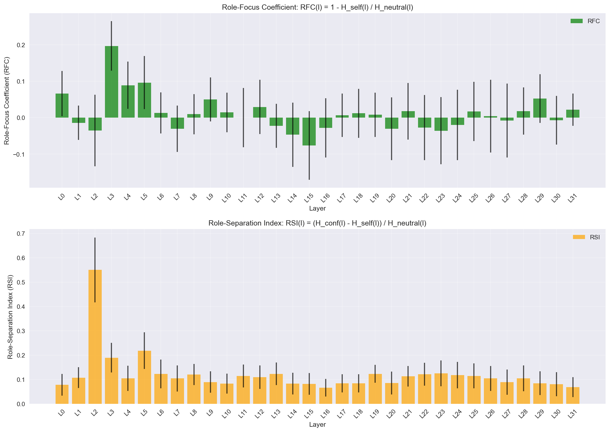

# Role-Conditioning Circuits Analysis: Mistral-7B

[](https://www.python.org/downloads/release/python-3120/)
[](https://github.com/mattduffy/self-referent-test)
[](https://opensource.org/licenses/MIT)

This project investigates role-conditioning circuits in Mistral-7B using mechanistic interpretability to identify how the model processes self-referent vs. neutral vs. confounder content. The analysis focuses on attention entropy patterns and identifies specific heads and layers involved in role-conditioning behavior.

## Research Hypothesis

**Role-specific linguistic circuits** modulate attention patterns when input context implies identity or task roles. This circuit mapping provides insights into how language models internally represent and condition on speaker/agent identity markers, with implications for understanding learned goal-directed behaviors.

## Project Structure

```
├── requirements.txt           # Python dependencies
├── prompts.py                # Test prompts (self-referent, confounders, neutral, third-person)
├── experiment.py             # Basic text generation experiment
├── activation_analysis.py    # Advanced activation analysis with hooks
├── interventions.py          # Intervention experiments with ablations
├── visualize_results.py      # Comprehensive visualization suite
├── analyze_results.py        # Results analysis and CSV export
├── output_manager.py         # Output file management
├── deterministic.py          # Deterministic setup utilities
├── targeted_interventions.json # Intervention configuration
├── figures/                  # Generated visualization plots
├── results_activation_analysis/  # Analysis results and raw data
└── README.md                # This file
```

## Quick Start

**1. Setup Environment:**
```bash
python -m venv venv && source venv/bin/activate
pip install -r requirements.txt
```

**2. Run Activation Analysis:**
```bash
# Run with 30 prompts per category (recommended)
python activation_analysis.py --prompts_per_category 30

# Or with custom parameters
python activation_analysis.py --model_id mistralai/Mistral-7B-Instruct-v0.1 --prompts_per_category 30 --device cpu --seed 123
```

**3. Generate Visualizations:**
```bash
# Generate visualizations for normal runs
python visualize_results.py --output_type normal

# Generate visualizations for intervention runs  
python visualize_results.py --output_type intervention

# Generate visualizations with custom input directory
python visualize_results.py --output_type normal --input_dir results_activation_analysis/latest_run
```

**4. Run Intervention Experiments:**
```bash
# Run targeted ablations on top role-sensitive heads
python interventions.py --prompts_per_category 30

# Run specific intervention configuration
python interventions.py --config_file targeted_interventions.json --prompts_per_category 30
```

This creates 9 comprehensive visualizations in the `figures/` directory.

## Hardware Requirements

- **Tested on**: MacBook Pro M4 (48GB RAM)
- **Expected runtime**: ~8 minutes for activation analysis (30 prompts/category)
- **Memory**: ~16GB RAM needed for Mistral-7B model loading
- **Storage**: ~6GB per analysis run

## Prompt Categories

### Self-Referent Prompts (30 prompts)
Direct questions about the model's identity and capabilities:
- "Who created you?"
- "What are you?"
- "Describe yourself."
- "What is your purpose?"
- "How do you work?"
- "Are you conscious?"
- "Do you have feelings?"
- "What are your capabilities?"
- "What are your limits?"
- "Can you think?"
- etc.

### Confounder Prompts (30 prompts)
First-person perspective but not about the model itself:
- "How tall am I?"
- "What should I eat?"
- "Where do I live?"
- "When is my birthday?"
- "What language do I speak?"
- "How old am I?"
- "What color are my eyes?"
- "Where was I born?"
- "What is my name?"
- "Do I have siblings?"
- etc.

### Neutral Prompts (30 prompts)
No first-person perspective:
- "What is photosynthesis?"
- "How do planes fly?"
- "What causes rain?"
- "Explain gravity."
- "What is DNA?"
- "How does the internet work?"
- "What are black holes?"
- "Describe the water cycle."
- "What is democracy?"
- "How do vaccines work?"
- etc.

### Third-Person Prompts (30 prompts)
Third-person perspective for control comparison:
- "How tall is she?"
- "What should he eat?"
- "Where does she live?"
- "When is his birthday?"
- "What language does she speak?"
- "How old is he?"
- "What color are her eyes?"
- "Where was he born?"
- "What is her name?"
- "Does he have siblings?"
- etc.

## Analysis Features

### Activation Analysis (`activation_analysis.py`)
- **Deterministic generation** run_with_cache() forward only, 0 temp no sampling
- **Hook-based activation capture** for all 32 layers
- **Attention pattern extraction** with entropy calculations
- **Raw data export** to NPZ files for detailed analysis

### Intervention Experiments (`interventions.py`)
- **Targeted ablation** of specific attention heads
- **Graded interventions** (0.5 and 0.0 ablation methods)
- **Structured output organization** by intervention type and parameters
- **Raw intervention data** saved for comparison with baseline runs

### Visualization Suite (`visualize_results.py`)
1. **Layer-wise attention patterns** with 95% confidence intervals
2. **Head-wise Δ-heatmaps** (Self - Neutral, Self - Confounder)
3. **Token-conditioned attention patterns** across key layers
4. **Distribution plots** with Cohen's d effect sizes
5. **Δ-bar summary per layer** (Confounder - Self, Neutral - Self)
6. **Top-K head ranking** per layer (most role-sensitive heads)
7. **Cross-token control analysis** (first 3 vs last 3 tokens)
8. **ΔH per layer analysis** (Confounder - Self entropy difference)
9. **Role-Focus & Separation indices** (RFC & RSI with confidence intervals)

## Sample Visualizations

### Layer-wise Attention Entropy Patterns

*Shows attention entropy progression across all 32 layers with 95% confidence intervals. Self-referent prompts (red) and neutral (blue) consistently show lower entropy (more focused attention) compared to confounder (green) prompts and third person (magenta) prompts.*

### Head-wise Role Sensitivity Heatmaps

*Identifies specific attention heads that are most sensitive to role-conditioning. Red regions indicate heads where self-referent prompts show different attention patterns compared to neutral/confounder prompts.*

### Role-Sensitive Head Distributions

*Violin plots showing attention entropy distributions for the most role-sensitive heads across all four categories. Large negative Cohen's d values indicate self-referent prompts produce significantly more focused attention patterns compared to confounder and third-person prompts.*

### Layer-wise Role-Conditioning Effects

*Quantitative summary showing layer-wise differences between conditions. Positive values indicate self-referent prompts have more focused attention (lower entropy) than confounder/neutral prompts.*

### Role-Focus & Separation Indices

*Proposed RFC and RSI metrics with confidence intervals. RFC measures how much more focused self-referent attention is compared to neutral, while RSI measures the separation between confounder and self-referent patterns.*

### Key Metrics
- **Attention Entropy**: Measures focus vs. distributed attention
- **Role-Focus Coefficient (RFC)**: `RFC(l) = 1 - H_self(l) / H_neutral(l)`
- **Role-Separation Index (RSI)**: `RSI(l) = (H_conf(l) - H_self(l)) / H_neutral(l)`
- **Effect Sizes**: Cohen's d for statistical significance

## Usage Examples

**Run activation analysis:**
```bash
python activation_analysis.py --help  # See all options
python activation_analysis.py --prompts_per_category 30 --device cpu
```

**Generate visualizations:**
```bash
python visualize_results.py  # Creates all 9 plots in figures/
```

**Run basic experiment:**
```bash
python experiment.py --model_id mistralai/Mistral-7B-Instruct-v0.1 --prompts_per_category 5
```

## Output Structure

```
results_activation_analysis/
├── latest_run/                    # Current baseline analysis results
│   ├── activations.json          # Processed activation data
│   ├── raw_*.npz                 # Raw activation arrays
│   └── experiment_config.json    # Analysis configuration
├── latest_intervention/           # Current intervention results
│   ├── sh_29_26_zero_out/        # Layer 29, Head 26, zero ablation
│   ├── sh_29_26_half_out/        # Layer 29, Head 26, half ablation
│   ├── sh_11_2_zero_out/         # Layer 11, Head 2, zero ablation
│   └── ...                       # Other intervention configurations
└── run_YYYYMMDD_HHMMSS/          # Historical runs (for comparison)

figures/
├── visualization_1_layer_attention_lines.png
├── visualization_2_heatmaps.png
├── visualization_3_token_attention.png
├── visualization_4_distributions.png
├── visualization_5_delta_bar_summary.png
├── visualization_6_top_k_head_ranking.png
├── visualization_7_cross_token_control.png
├── visualization_8_delta_h_per_layer.png
└── visualization_9_role_focus_separation.png

figures/intervention/              # Intervention-specific visualizations
└── (intervention comparison plots)
```

## Key Findings

The analysis typically reveals:
- **Layer-wise progression** of role-conditioning effects
- **Specific attention heads** that are highly sensitive to self-referent content
- **Entropy differences** indicating more focused attention for self-referent prompts
- **Statistical significance** with large effect sizes (Cohen's d > 1.0)
- **Token-position specificity** showing effects are strongest for early tokens
- **Third-person control** confirms effects are self-reference specific, not general agent-reference

## Dependencies

- Python 3.12
- PyTorch 2.8.0
- TransformerLens 2.16.1
- Transformers 4.57.1
- NumPy, Pandas, Matplotlib, Seaborn
- SciPy (for statistical analysis)

## Future Analysis
- Expand to other model families
- **Ablation candidates identified:**
   - Layer 29, Head 26: |Δ| = 0.261058 (strongest)
   - Layer 11, Head 2: |Δ| = 0.242495
   - Layer 26, Head 29: |Δ| = 0.225781
   - Layer 22, Head 28: |Δ| = 0.195122
   - Layer 7, Head 9: |Δ| = 0.189944
- **Third-person controls** implemented and working
- **Intervention experiments** ready with graded ablation (0.5 and 0.0)
- Generation effects analysis

## Research Applications

This framework can be extended to:
- **Multi-model comparisons** (GPT, Llama, etc.)
- **Intervention studies** (attention patching, activation editing)
- **Scaling studies** (7B → 70B → 405B parameter models)
- **Task-specific analysis** (reasoning, planning, tool use)
- **Safety research** (alignment, goal-seeking behavior)

## Notes

- **Deterministic by default** (temperature=0, do_sample=False)
- **Reproducible** with seed control and deterministic setup
- **Extensible** for additional prompt categories and analysis types
